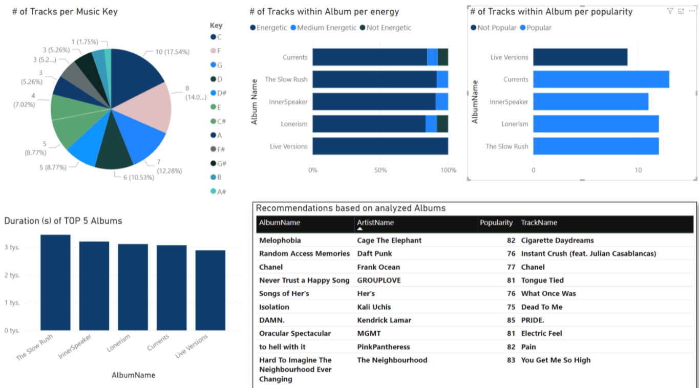

# Spotify Data Analysis Project

Welcome to the Spotify Data Analysis Project! This repository contains code and resources for performing data analysis based on Spotify API data. The project involves ETL (Extract, Transform, Load) operations using Azure Databricks, data processing with Python, PySpark, and SparkSQL, and final visualizations in PowerBI. The data analysis and visualizations are based on user playlists, which require a playlist ID to be provided.

## Table of Contents

- [Introduction](#introduction)
- [Features](#features)
- [Technologies Used](#technologies-used)
- [Getting Started](#getting-started)
  - [Prerequisites](#prerequisites)
  - [Installation](#installation)
  - [Configuration](#configuration)
  - [Running the Project](#running-the-project)
- [Data Analysis](#data-analysis)
- [Visualizations](#visualizations)

## Introduction

This project demonstrates how to use the Spotify API to perform data analysis on user playlists. The ETL operations are written in Python, PySpark, and SparkSQL within Azure Databricks. The processed data is then visualized in PowerBI. The analysis provides insights such as the top 5 longest albums, album popularity, energy levels, tracks per audio keys, and recommended tracks based on the user's provided playlist.

## Features

- ETL operations using Azure Databricks
- Data processing with Python, PySpark, and SparkSQL
- Visualizations in PowerBI
- Analysis based on user-provided playlist ID
- Insights include:
  - Top 5 longest albums
  - Albums per popularity
  - Albums per energy
  - Tracks per audio keys
  - Recommended tracks

## Technologies Used

- **Python**
- **PySpark**
- **SparkSQL**
- **Azure Databricks**
- **Spotify API**
- **PowerBI**

## Getting Started

### Prerequisites

- Azure Databricks account
- PowerBI Desktop
- Spotify Developer account and API credentials
- Python 3.x
- Required Python packages: `requests`, `pyspark`, `json`

### Installation

1. Clone this repository to your local machine:
    ```sh
    git clone https://github.com/KamilKolanowski/spotify-data-analysis.git
    ```

2. Navigate to the project directory:
    ```sh
    cd spotify-data-analysis
    ```

3. Install the required Python packages:
    ```sh
    pip install -r requirements.txt
    ```

### Configuration

1. Obtain Spotify API credentials by creating an app on the [Spotify Developer Dashboard](https://developer.spotify.com/dashboard/).
2. Set up your credentials in Databricks Secret Scope:
    ```sh
    SPOTIFY_CLIENT_ID='your_client_id'
    SPOTIFY_CLIENT_SECRET='your_client_secret'
    SPOTIFY_REDIRECT_URI='your_redirect_uri'
    ```

### Running the Project

1. Upload the ETL scripts to your Azure Databricks workspace.
2. Execute the ETL notebooks to extract, transform, and load the Spotify data.
3. Save the processed data tables in Databricks.
4. Connect PowerBI to Databricks to create visualizations.

## Data Analysis

The ETL process extracts data from the Spotify API and processes it to provide insights on:

- The top 5 longest albums based on track duration.
- Album popularity measured by Spotify's popularity metric.
- Album energy levels, with energy values ranging from 0 to 1.
- Distribution of tracks per audio key.
- Recommended tracks based on the user's provided playlist.

## Visualizations

The final visualizations are created in PowerBI and cover the following aspects:

1. **Top 5 Longest Albums:** A bar chart showing the five albums with the longest total duration.
2. **Albums per Popularity:** A bar chart representing album popularity.
3. **Albums per Energy:** A bar chart depicting energy levels of albums.
4. **Tracks per Audio Keys:** A pie chart showing the count of tracks in each audio key.
5. **Recommended Tracks:** A table of recommended tracks based on the user's playlist.


